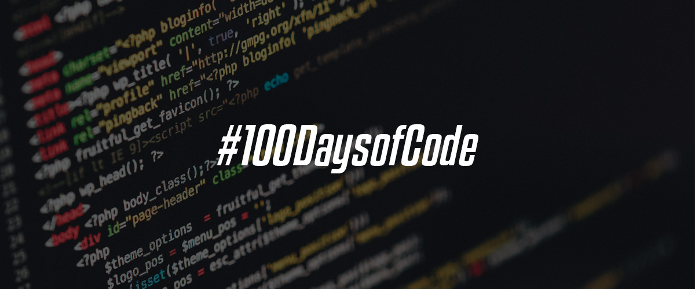

 

# 🚀 #100DaysOfCode

<h3>
 
</h3>

## 📅 Timeline

| **Day 📌** | **Date 📅**  | **Lessons/Tasks Done ⏰**                                                       | **Links 🔗**                         |
| ---------- | ------------ | ------------------------------------------------------------------------------- | ------------------------------------ |
| Day 1      | Jan 01, 2023 | Start at Orange Tech + Bootcamp at Digital Innovation One                       | [DIO](https://www.dio.me/)           |
| Day 2      | Jan 02, 2023 | Learning Computational Thinking and Modern Software Development                 | [_Notes_ 📜](./courses/orange-tech/) |
| Day 3      | Jan 03, 2023 | Learning Agile Teams and Git and GitHub                                         | [_Notes_ 📜](./courses/orange-tech/) |
| Day 4      | Jan 04, 2023 | Learning to create Interactive First Pages with JavaScript                      | [_Notes_ 📜](./courses/orange-tech/) |
| Day 5      | Jan 05, 2023 | Started reading the book Clean Code: A Handbook of Agile Software Craftsmanship | [_Book_ 📖](https://a.co/d/5zvvr8V)  |
| Day 6      | Jan 06, 2023 | Practicing with Variables, Operators, and Conditional Structures in Javascript  | [_Notes_ 📜](./courses/orange-tech/) |
