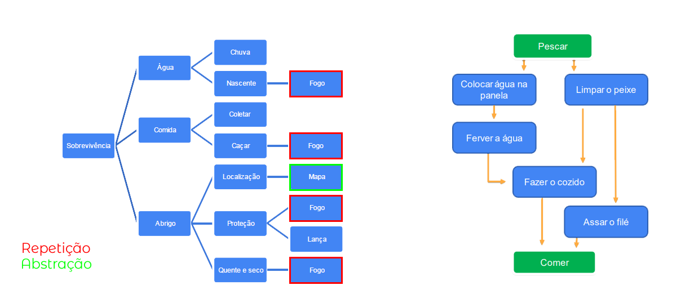

# 🧠 Aula 1: Pensamento computacional

## 💭 Introdução ao pensamento computacional

Conceito:

> _Processo de pensamento envolvido na expressão de soluções em passos computacionais ou algoritmos que podem ser implementados no computador_ (Aho, 2011; Lee, 2016)

### Principais pilares:

#### 1. Decomposição:

- Dividir um problema complexo em subproblemas.

#### 2. Reconhecimento de padrões

- Identificar padrões ou tendências
- Similaridades e diferenças entre os problemas

#### 3. Abstração

- Extrapolar o conceito do problema para um forma generalista

#### 4. Design de algoritmos

- Definir passo a passo a solução do problema.

## ✨ Habilidades complementares

### Raciocínio Lógico

Pensamento Lógico estruturado que permite encontrar conclusões ou deduções na resolução de um problema.

#### 1. Indução

- Relacionado as Ciências Experimentais (empirismo)
- Fenômenos observados

#### 2. Dedução

- Relacionado as Ciências exatas
- Previsões e explicações

#### 3. Abdução

- Processo investigativo
- Premissa
- Conclusão

### Aperfeiçoamento

A partir de uma solução, determinar pontos de melhora e refinamento.

- Encontrar solução eficiente
- Otimizar processos
- Simplificar linhas de códigos
- Funções bem definidas

## 🏛️ Pilares: Decomposição

### Estratégias:

- Processo de quebrar e determinar partes menores e gerenciáveis
- Combinar os elementos recompondo o problema original
- Ordem de execução de tarefas menores

## 🏛️ Pilares: Padrões

### Reconhecimento de Padrões:

- Modelo base
- Estrutura invariante
- Repetição

> Generalizar, com objetivo de obter resolução para problemas diferentes.

### Aplicações:

- Classificação de dados
- Reconhecimento de imagem
- Reconhecimento de fala
- Análise de cenas
- Classificação de documentos

## 🏛️ Pilares: Abstração

> ABSTRAIR: Observar, um ou mais elementos, avaliando características e propriedades em separado.

> ABSTRAÇÃO: Processo intelectual de isolamento de um objeto da realidade.

> GENERALIZAR: Tornar-se geral, mais amplo, extensão.

> **Generalização**, na lógica, é a operação intelectual que consiste em reunir numa classe geral, um conjunto de seres ou fenômenos similares

### Como classificar os dados?

- Características
- Pontos essenciais
- Generalizar x detalhar

### Aplicações:

- _Merge sort_, _Clustering_, Busca Binária
- Árvore, Listas, Grafos
- Máquina de estado finito
- Linguagens de programação

## 🏛️ Pilares: Algoritmos

> Um computador não opera sozinho, precisa de instruções detalhadas.

### Desenvolvimento do Programa

- **Análise**: Estudo e definição dos dados de entrada e saída.
- **Algoritmo**: Descreve o problema por meio de ferramentas narrativas, fluxograma, ou pseudocódigo.
- **Codificação**: O algoritmo é codificado de acordo com a linguagem de programação escolhida.

### Como construir um algoritmo?

- Compreensão do problema
- Definição dados de entrada
- Definir processamento
- Definir dados de saída
- Utilizar um método de construção
- Teste e diagnóstico

### Construção de algoritmos

- Narrativa
- Fluxograma
- Pseudocódigo

## 🔥 Estudo de caso conceitual: perdido



## 💻 Estudo de caso aplicado: soma de um intervalo

### 🧮 Algoritmo:

#### Passo 1 – Recebe os valores (x e y)

> Leia (x, y)

#### Passo 2 – Resolva:

> y/2 = total

#### Passo 3 – Resolva:

> y+x = resultado_parcial

#### Passo 4 – Ache o total

> Final = total x resultado_parcial

#### Passo 5 – Imprima o resultado

> Imprima (Final)

## 🤔 Estudo de caso aplicado: adivinhe o número

O problema consiste em determinar o número escolhido por uma pessoa dentro de um intervalo.

### 🔎 Busca binária:

Passo 1 – Ordenar o vetor

Passo 2 – Módulo de L/2

Passo 3 – Acessar estrutura

Passo 4 – Comparar valores

Passo 5 – Repita até encontrar o número

Passo 6 – Imprima "Busca bem sucedida"

# 🎳 Aula 2: Introdução à Lógica de programação

Definição:

> Parte da filosofia que trata das formas do pensamento em geral (dedução, indução, hipótese, inferência etc.) e das operações intelectuais que visam à determinação do que é verdadeiro ou não.

> Organização e planejamento das instruções, assertivas em um algoritmo, a fim de viabilizar a implantação de um programa.

## 🧩 Técnicas de Lógica de Programação

### Técnica Linear

- Modelo tradicional
- Não tem vínculo
- Estrutura hierárquica
- Programação de computadores

### Técnica Estruturada

- Maior nível de complexidade
- Não linearidade

### Técnica Modular

- Controlada por um conjunto de regras
- Modulação

# 🎪 Aula 3: Fundamentos de algoritmos

## 📁 Tipologias

- Caracteres (Caractere)
- Lógicos (Verdadeiro ou Falso)
- Numéricos (Inteiro, Real, Etc.)

## 📬 Variável

> pode assumir qualquer um dos valores de um determinado conjunto de valores.

### Regras de variável

- Atribuição de um ou mais caracteres
- Primeira letra - não número
- Sem espaços em branco
- Vedado (Utilização de palavras reservadas)
- Caracteres e números

## 🔰 Instruções primitivas

> Instruções são linguagem de palavras-chave (vocabulário) de uma determinada de programação que tem por finalidade comandar um computador que irá tratar os dados

### Operadores

| Operador | Operação            | Tipo     | Prioridade Matemática |
| -------- | ------------------- | -------- | --------------------- |
| `+`      | Manutenção de sinal | Unitário | 1                     |
| `-`      | Inversão de sinal   | Unitário | 1                     |
| `^`      | Exponenciação       | Binário  | 2                     |
| `/`      | Divisão             | Binário  | 3                     |
| `*`      | Multiplicação       | Binário  | 3                     |
| `+`      | Adição              | Binário  | 4                     |
| `-`      | Subtração           | Binário  | 4                     |

### Exemplo: Média escolar

```Portugol
Início programa:

    Nota1 = 5
    Nota = 8
    Resultado = 0

    Resultado = (Nota1 + Nota2)/2

    Escreva resultado

Fim programa

Saída:
    6.5
```

## 🔀 Estruturas condicionais e operadores

> Condição: Estado de uma pessoa ou coisa

> Condicional: contem ou implica uma suposição ou hipótese

### Operadores relacionais

| Operador       | Símbolo |
| -------------- | :-----: |
| Igual          |   ==    |
| Diferente      |   !=    |
| Maior          |    >    |
| Maior ou igual |   >=    |
| Menor          |    <    |
| Menor ou igual |   <=    |

### Condicional Simples

```Portugol
Início programa:

    A = 0
    B = 0
    X = 0

    leia A
    leia B

    X = A + B

    se (X > 10)
        escreva X
    Fim se

Fim programa
```

### Condicional Composta

```Portugol
Início programa:
    A = 0
    B = 0
    X = 0

    leia A
    leia B

    X = A + B

    se (X >= 10)
        X = X-7
    Senão
        X = X+5

    Fim se
Fim programa
```

### Operadores Lógicos

**AND – operador Lógico**

| Condição 1 | Condição 2 | Resultado  |
| :--------: | :--------: | :--------: |
|   Falsa    |   Falsa    |   Falso    |
| Verdadeira |   Falsa    |   Falso    |
|   Falsa    | Verdadeira |   Falso    |
| Verdadeira | Verdadeira | Verdadeiro |

**OR – operador Lógico**

| Condição 1 | Condição 2 | Resultado  |
| :--------: | :--------: | :--------: |
|   Falsa    |   Falsa    |   Falso    |
| Verdadeira |   Falsa    | Verdadeiro |
|   Falsa    | Verdadeira | Verdadeiro |
| Verdadeira | Verdadeira | Verdadeiro |

**NOT – operador Lógico**

| Condição 1 | Resultado  |
| :--------: | :--------: |
| Verdadeira |   Falso    |
|   Falsa    | Verdadeiro |

## 🔁 Estruturas de repetição

### Enquanto

Teste lógico

- Início

Número de repetições

- indefinidas

```Portugol
grama = Falso

Enquanto (grama == falso) faça

<instrução de cortar grama>
<atualiza grama>

fim enquanto
```

### Repita

Teste lógico

- final

Número de repetições

- indefinidas

### Para

Teste lógico

- Início

Número de repetições

- Definidas

```Portugol
somatório = 0

para inicio = 1 até 10

    somatório = somatório + inicio
    Escreva somatório

fim para
```

## 🎭 Vetores e matrizes

### Vetores:

> Um vetores é caracterizado por uma variável dimensionada com tamanho pré-fixado.

### Matriz:

> Matriz é uma tabela organizada em linhas e colunas no formato m x n, onde m representa o número de linhas (horizontal) e n o número de colunas (vertical)

## 🤔 O que são funções?

> As funções, ou sub-rotinas são blocos de instruções que realizam tarefas específicas

### Funções:

Blocos de instruções (código), identificados por nomes e parâmetros

```Portugol
funcao mediaescolar(nota1,nota2)

    resultado = 0
    resultado = (Nota1 + Nota2)/2

    retorne  resultado

fim funcao

------------------------------------------

aluno1 = mediaescolar(nota11,nota21)
aluno2 = mediaescolar(nota12,nota22)
aluno13 = mediaescolar(nota13,nota23)
```

## 💾 Instruções de entrada/saída

### Instruções de entrada

> Consiste na inserção e recebimento de dados do mundo real por meio de ação de alguma interface, seja teclado, mouse, arquivos, entre outros.

### Instruções de saída

> Consiste na impressão dos dados do mundo abstrato, digital por meio de ação de alguma interface.

> Os formatos podem variar desde simples arquivos binários até complexas query's de banco de dados.

# 🍀 Aula 4: Linguagens de programação

## 🐍 Introdução à linguagem de programação

### O que é uma linguagem de programação?

> Método padronizado composto por um conjunto de regras sintáticas e semânticas de implementação de um código fonte

### Como o computador entende o programa?

Linguagem de alto nível -> Compilador -> Linguagem de máquina

**Tradução:**

- (1) Geração do programa objeto
- (2) Execução do programa objeto

**Interpretação:**

- Programa fonte executado diretamente

## 💬 Características de um programa

### Diretrizes do Desenvolvimento de Programas

1. Legibilidade

   - Facilidade de leitura
   - Compreensão
   - Ortogonalidade
   - Definição adequada das estruturas

2. Redigibilidade

   - Pode conflitar com a legibilidade
   - Ortogonalidade
   - Simplicidade da escrita
   - Suporte à abstração
   - Reuso do código
   - Expressividade

3. Confiabilidade

   - Verificação de tipos
   - Trata exceções
   - Uso de ponteiros
   - Compatibilidade entre compiladores

4. Custo

   - Treinamento
   - Codificação
   - Compilação
   - Execução
   - Infra-estrutura

## 🔎 Análises de código

### Análise

#### Análise léxica

> Particionar -> Classificar -> Eliminar

#### Análise sintática

> Exatidão do programa

#### Análise semântica

> Lógica do programa

## 🧩 Paradigmas de programação

> Forma de resolução de problemas com diretrizes e limitações específicas de cada paradigma utilizando linguagem de programação.

### Classificação

1. Orientação à Objeto
2. Procedural
3. Funcional
4. Estruturado
5. Computação distribuída
6. Lógico

### Paradigma Estruturado

Conceitos:

- Sequência
- Decisão
- Iteração

Utilização:

- Problemas simples e diretos
- Aprender programação

### Paradigma de Orientação à Objeto

#### O que é um objeto?

> Um objeto é descrito por características específicas, comportamentos e estado

#### Classe Caneta:

```Portugol
classe caneta():

    cor: inteiro
    carga: caracter
    tampada: lógico

    metodo escrever()
    Se estado tampada
        Escreva ("Destampar")
    Senão
        Escreva ("algo")
    Fimse

    metodo tampar()
    Tampada = verdadeiro

fimclasse
```

#### Pilares de Orientação a Objeto

1. Herança
2. Encapsulamento
3. Polimorfismo
4. Abstração
