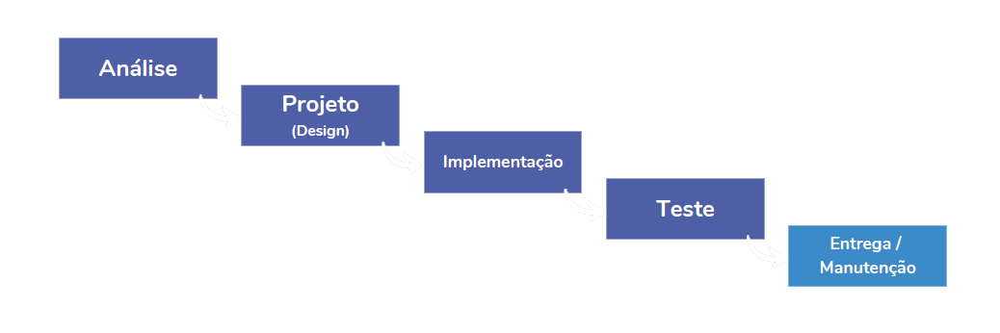
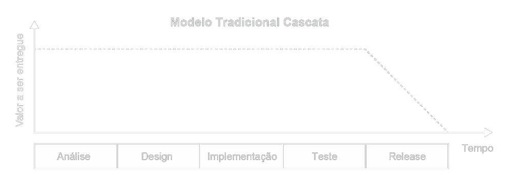

# Aula 1: Introdução à Cultura Ágil

## ⚖️ Os valores do Manifesto Ágil

#### **Individuals and interactions** _over processes and tools_:

> Indivíduos e interações tem mais valor que processos e ferramentas. A valorização das pessoas bem como o convívio saudável entre elas é fundamental para gerar um ambiente agradável, produtivo e motivador.
> Com um bom ambiente e a motivação certa, pessoas produzem mais e melhor. Não esqueça que ferramentas e processos são feitos por pessoas.

#### **Working software** _over comprehensive documentation_:

> Software funcionando tem mais valor que uma documentação abrangente. Um produto que está funcionando, pode ir para o mercado, ou para a aprovação do cliente, o que acelera o recebimento da receita para a empresa.
> A documentação não agrega valor para o cliente e pode esperar.

#### **Customer collaboration** _over contract negotiation_:

> Colaboração com o cliente vale mais que negociação de contratos. O relacionamento com o cliente é tão importante quanto a importância que você quer que ele tenha com o seu trabalho. Mostre que você se importa com ele e quer oferecer a melhor solução possível e terá um cliente que colabora com você.

#### **Responding to change** _over following a plan_:

> Responder a mudanças é mais importante que seguir um plano. O mercado muda, o cliente muda, o usuário muda, logo, seu plano também tem prazo de validade. Seu software deve estar preparado para aguentar mudanças.

## 💡 Princípios do Manifesto Ágil

#### 1) Our highest priority is to satisfy the customer through early and continuous delivery of valuable software.

> Nossa maior prioridade é satisfazer o cliente através da entrega antecipada e contínua de software com valor. Ou seja, entregar continuamente software funcional e com valor agregado.
> Entregar rapidamente pequenos lotes de funcionalidades é mais importante para o cliente do quê receber uma grande funcionalidade após um grande período de tempo, colocando em risco do produto não atender o "time-to-market".

#### 2) Welcome changing requirements, even late in development. Agile processes harness change for the customer's competitive advantage.

> Mudanças de requisitos são bem-vindas, mesmo no final do desenvolvimento, pois processos ágeis estão prontos para receber mudanças que geram vantagem competitiva para o cliente.
> É normal (e muito comum para funcionalidades, com prazos longos) receberem alterações devido às modificações do mercado, do negócio do cliente e diversos fatores externos. Reforçamos que o software deve estar pronto para mudanças.

#### 3) Deliver working software frequently, from a couple of weeks to a couple of months, with a preference to the shorter timescale.

> Entregar software funcionando com frequência, desde poucas semanas até poucos meses, mas de preferência no menor tempo possível.
> Software entregue é igual valor agregado para o cliente, e nossa missão como desenvolvedores é entregar valor para o cliente no menor tempo possível.

#### 4) Business people and developers must work together daily throughout the project.

> Empresários e desenvolvedores devem trabalhar juntos diariamente durante o projeto. Grande parte do retrabalho no desenvolvimento de software é ocasionado por ruídos na comunicação entre o cliente/empresário e o desenvolvedor. Isto ocorre, pois muitas empresas possuem uma pessoa que coleta os requisitos, uma que desenha a solução e outra que executa. Com isso, o desenvolvedor acaba não percebendo o valor para o cliente, muitas vezes entregando algo que não atende a necessidade plenamente. Quanto mais íntima for a relação do empresário/cliente com o desenvolvedor, maior o conhecimento do negócio por parte do desenvolvedor e maior a percepção das limitações do desenvolvimento por parte do empresário/cliente. Esta aproximação possibilita que uma solução mais enxuta e de valor seja entregue de forma rápida.

#### 5) Build projects around motivated individuals. Give them the environment and support they need, and trust them to get the job done.

> Crie projetos com indivíduos motivados. Dê a eles o ambiente e suporte que precisam, e confie neles para entregar o trabalho. Pessoas desmotivadas fazem o que devem, não o seu melhor. Dê motivação para as pessoas e terá a melhor equipe que você pode ter!

#### 6) The most efficient and effective method of conveying information to and within a development team is face-to-face conversation.

> O método mais eficiente e eficaz de transmitir informações para uma equipe de desenvolvimento é a conversa cara-a-cara.
> Evite e-mails e telefonemas sempre que possível, quando assegurar que uma informação precisa ser transmitida com clareza. Utilize e-mails para formalizar/registrar informações, mas nunca confie neles como uma garantia do recebimento.

#### 7) Working software is the primary measure of progress.

> Software funcionando é a principal medida de progresso. Leia-se como "software escrito com qualidade" funcionando.
> A melhor forma de saber se nosso produto está dando certo é lançar um MVP, ou lançar pequenas features.

#### 8) Agile processes promote sustainable development. The sponsors, developers, and users should be able to maintain a constant pace indefinitely.

> Processos ágeis geram desenvolvimento sustentável. Os investidores, desenvolvedores e usuários devem ser capazes de manter um ritmo constante sempre.
> O processo ágil, promove a interação entre todos os envolvidos, pois as partes se tornam interdependentes.

#### 9) Continuous attention to technical excellence and good design enhances agility.

> Dedicação contínua à excelência técnica e bom design aumenta a agilidade.
> Quanto melhor for a arquitetura e qualidade do código, mais preparado o software estará para responder à mudanças. Construir um software apenas pensando que ele "está funcionando" não garante que o mesmo está preparado para as variações de mercado/requisitos.

#### 10) Simplicity the art of maximizing the amount of work not done is essential.

> Simplicidade - a arte de maximizar a quantidade de trabalho não feito - é essencial. O software agregar valor no menor tempo possível, para isso deve ter entregar rápidas e simples. Perder tempo tentando prever ou impor necessidades inexistentes gera trabalho desnecessário e com risco de nunca ser utilizado.

#### 11) The best architectures, requirements, and designs emerge from self-organizing teams.

> As melhores arquiteturas, requisitos e designs emergem de equipes auto-organizadas. Equipes que precisam de cobranças constantes simplesmente são ociosas quando não há cobrança, ou seja, não são auto-suficientes.
> Criar uma cultura de responsabilidade pessoal e coletiva permite que a equipe e os indivíduos se auto-gerenciem, desligando a necessidade de uma gestão autocrática e criando um comportamento de melhoria contínua.

#### 12) At regular intervals, the team reflects on how to become more effective, then tunes and adjusts its behavior accordingly.

> Em intervalos regulares, a equipe reflete sobre como se tornar mais eficaz, em seguida, altera seu comportamento isto. Precisamos monitorar e descobrir quais foram nossas falhas e acertos, para sabermos que tipo de comportamento precisamos manter ou eliminar, buscando assim uma melhoria continua.

## 👔 Características de um time ágil

- Alinhado com o cliente e stakeholders
- Auto-organizado e Responsável
- Multidisciplinar
- Entrega valor continuamente
- Está sempre aprendendo Melhoria contínua
- Possui métricas e metas claras
- Unido

# Aula 2: Gerenciamento de Projetos Ágil

## 🎭 Projeto x Processo

#### Processo

- É recorrente e contínuo
- É replicável
- Geralmente é repetitivo e realizado regularmente

#### Projeto

- Um esforço temporário para atingir um objetivo
- O resultado é exclusivo
- Tem início e fim bem definidos

## 🎭 Modelo Ágil x Tradicional

#### Modelo Tradicional Cascata (Waterfall)

- Planejamento inicial
  - Escopo
  - Custo
  - Cronograma
- Valor entregue no final

#### Modelo Ágil com Scrum

- Planejamento por Sprints
- Desenvolvimento iterativo e incremental
- Valor entregue continuamente

## 📈 O que é Gestão Ágil?

- Flexível e que se adapte às mudanças
- Colaborativa e que gere transparência
- Voltada ao aprendizado
- Entrega Contínua de Valor

# Métodos e Ferramentas Ágeis

## 🔁 Framework Scrum

> _"Scrum é um framework leve que ajuda pessoas, times e organizações a gerar valor por meio de soluções adaptativas para problemas complexos."_ Scrum Guide (Nov. 2020)

### Pilares do Scrum

#### 1. Transparência

A transparência permite que todos os ângulos de qualquer processo Scrum sejam observados por qualquer pessoa. Isto promove um fluxo de informação fácil e transparente em toda a organização e cria uma cultura de trabalho aberta.

#### 2. Inspeção

A inspeção é a arte de pensar, no sentido de aplicar uma visão crítica sobre o que está acontecendo. É detectar variações ou problemas potencialmente indesejáveis.

#### 3. Adaptação

A adaptação acontece quando o Time Scrum aprende através da transparência e da inspeção e, em seguida, adaptam o processo ao fazerem melhorias no trabalho que está sendo realizado, evitando, também, novos desvios.

### Framework ou Metodologia ágil?

- O framework Scrum é propositalmente incompleto, apenas definindo as partes necessárias para implementar a teoria Scrum.
- Em vez de fornecer às pessoas instruções detalhadas, as regras do Guia do Scrum orientam seus relacionamentos e interações.

## 🐴 Extreme Programming (XP)

É uma metodologia que tem como objetivo criar sistemas com alta qualidade, com base em uma interação próxima com os clientes, testagem constante e ciclos de desenvolvimento curtos.

**Objetivo principal:** fazer ciclos de entregas rápidos, contínuos e incrementais, para atingir os resultados esperados pelo cliente.

### O que tem no XP?

1. Ciclos
2. Cerimônias
3. Testes
4. Programação em pares
5. Feedback
6. Aproximação com o cliente
7. Flexibilidade

## 📝 Kanban

É um método para **definir, gerenciar e melhorar serviços**, que entregam trabalho de conhecimento, como serviços profissionais, atividades criativas e o design de produtos físicos e de software.

### História

- Desenvolvido pela Toyota na década de 40
- Problema: Gestão de estoque

> Com o intuito de equilibrar a sua produção para evitar essas duas situações a Toyota (fabricante de automóveis) desenvolveu o método Kanban na década de 1940, que foi englobado como uma parte doSistema Toyota de Produção.

Na atualidade, o quadro Kanban ultrapassou os limites da indústria e passou a ser utilizado em diferentes áreas, como:

- Em equipes de marketing
- Prestação de serviços
- Desenvolvimento de softwares

## 🔑 **O**bjectives **K**ey **R**esults (OKR)

### Objectives

Os objetivos do OKR são descrições qualitativas que apontam a direção que deverá ser seguida pela empresa.

- **Claro**
- **Inspirador**
- **Desafiador**
- **Alinhado com a missão do negócio**

### Key Results

Os resultados-chave, também chamados apenas de KRs, são as metas que determinam o atingimento do objetivo na metodologia OKR.

- **Baseadas em indicadores-chave de desempenho (KPIs)**
- **Quantitativas**
- **SMART: Específicas, Mensuráveis, Atingíveis, Relevantes e Temporais**

### Benefícios

- Agilidade
- Cooperação
- Transparência
- Monitoramento contínuo
